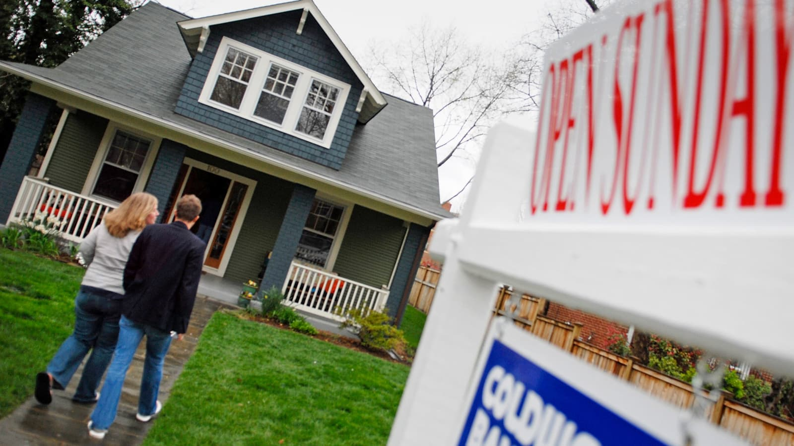

# Predicting-Boston-House-Prices-using-Linear-Regression-Techniques

## Objective
In this project, i will try to perform some linear regression techniques in order to predict the Boston House Prices.

## Background

When people are looking for a new house, the first aspect we should consider is absolutely the price of a house that should be adjusted and matched to our budget. The price of a house is usually determined by many factors, such as the number of room per house, land area, the access to highways, and much more. Therefore, i would like to create some machine learning models using [linear regression techniques](https://en.wikipedia.org/wiki/Linear_regression) to predict the house prices and to compare which model performing the best.

The dataset used in this project is the [Boston House Price dataset](https://archive.ics.uci.edu/ml/machine-learning-databases/housing/) from the UCI Machine Learning Repository or you can download it via [kaggle](https://www.kaggle.com/vikrishnan/boston-house-prices) too. Each record in the dataset describes about concerns housing values in suburbs of Boston. The data was drawn from the Boston Standard Metropolitan Statistical Area (SMSA) in 1970. The attributes are defined as follows:
1. `CRIM` : per capita crime rate by town
2. `ZN` : proportion of residential land zoned for lots over 25,000 sq.ft.
3. `INDUS` : proportion of non-retail business acres per town
4. `CHAS` : Charles River dummy variable (= 1 if tract bounds river; 0 otherwise)            
5. `NOX`: nitric oxides concentration (parts per 10 million)
6. `RM` : average number of rooms per dwelling
7. `AGE` : proportion of owner-occupied units built prior to 1940
8. `DIS` : weighted distances to five Boston employment centres
9. `RAD` : index of accessibility to radial highways
10. `TAX` : full-value property-tax rate per \$10,000
11. `PTRATIO`: pupil-teacher ratio by town
12. `BLACK` : 1000(Bk - 0.63)^2 where Bk is the proportion of blacks by town         
13. `LSTAT` : \% lower status of the population
14. `MEDV` : Median value of owner-occupied homes in \$1000's

There aren't any missing attribute values in this dataset. 
