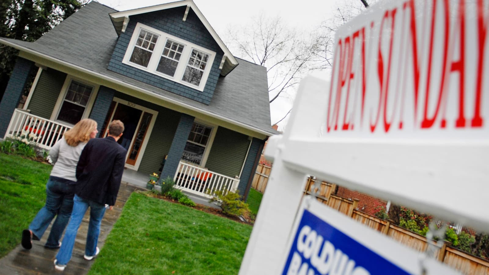
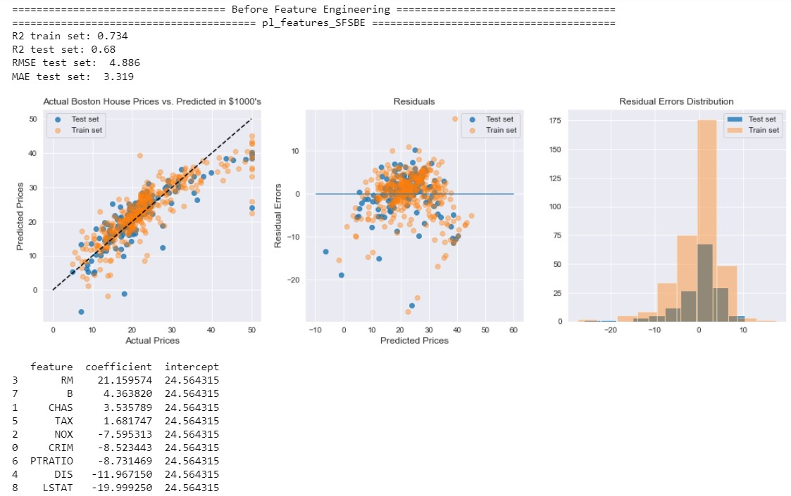
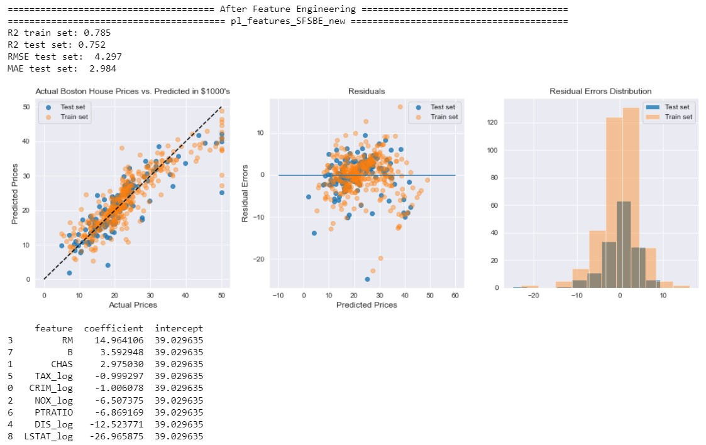
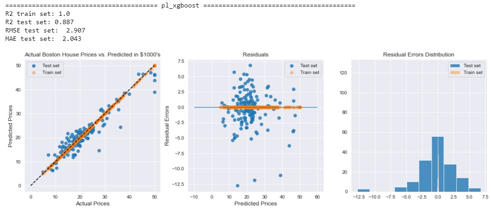
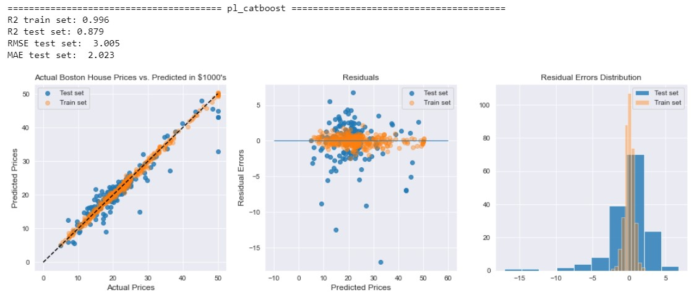
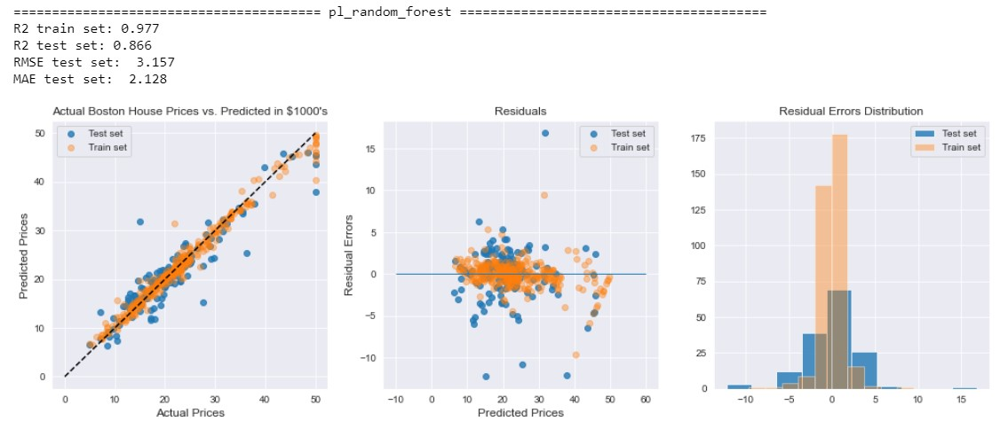
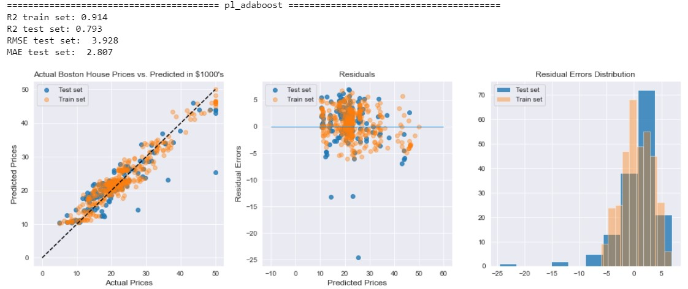

# Introduction
House prices are influenced by many factors and conditions such as the number of bedrooms, land or building areas, the access to highways, and many more. Estimating house prices based on such features are very useful for everyone who want to buy their own dream house or even rent a residence for living. 

To estimate house price, we can use a statistical model called Linear Regression. Linear Regression is one of the oldest statistical method used to find the linear relationship between numerical input and numerical output. It means that the hypothesis function to be estimated by Linear Regression is in the form of linear combination of their input feature values. It makes predictions by discovering the best fit line that reaches the most data points. Once the hypothesis function is learned, it can start to predict the output based on the feature coefficients that they have learned.

So why is Linear Regression? We know that this is very old school method but this algorithm is one of the most easiest model to be interpreted. As time goes by, some advanced learning algorithm such gradient boosting and deep learning have been being the state of the art in machine learning, yet they couldn't be interpreted easily.

## Objective
- To build a machine learning model that estimate the house prices using Linear Regression techniques.

## Methodology
- Learning algorithm using Linear Regression.
- Feature selection using Lasso Regression and Sequential Feature Selection with Backward Elimination.

## The dataset
The dataset for this project is [Boston House Price dataset](https://archive.ics.uci.edu/ml/machine-learning-databases/housing/) from the UCI Machine Learning Repository or you can load it directly through `sklearn.datasets.load_boston` in Python environment. It describes about concerns housing values in suburbs of Boston. The data was drawn from the Boston Standard Metropolitan Statistical Area (SMSA) in 1970. The attributes are defined as follows,
1. `CRIM `: per capita crime rate by town
2. `ZN`: proportion of residential land zoned for lots over 25,000 sq.ft.
3. `INDUS`: proportion of non-retail business acres per town
4. `CHAS`: Charles River dummy variable (= 1 if tract bounds river; 0 otherwise)
5. `NOX`: nitric oxides concentration (parts per 10 million)
6. `RM`: average number of rooms per dwelling
7. `AGE`: proportion of owner-occupied units built prior to 1940
8. `DIS`: weighted distances to five Boston employment centres
9. `RAD`: index of accessibility to radial highways
10. `TAX`: full-value property-tax rate per \$10,000
11. `PTRATIO`: pupil-teacher ratio by town
12. `B`: 1000(Bk - 0.63)^2 where Bk is the proportion of blacks by town
13. `LSTAT`: % lower status of the population
14. `MEDV`: Median value of owner-occupied homes in $1000's

# Interpretations
- `pl_features_SFSBE` represents trained Linear Regression model using features from "Sequential Feature Selection with Backward Elimination" without feature engineering.
- `pl_features_SFSBE_new` represents trained Linear Regression model using features from "Sequential Feature Selection with Backward Elimination" with feature engineering.

- House prices in Boston are mostly influenced by features such as `RM`, `LSTAT_log` and `DIS_log`.
- `RM` is the highest positive coefficient parameter that affect house prices in Boston while `LSTAT_log` is the highest negative coefficient.
- The y-intercept can be interpreted that in general the starting price of a house in Boston would be around 39K USD.
- Coefficient interpretation example:
    - An increase of 1 point in `RM`, while the other features are kept fixed, then the house price, `PRICE`, increases by 14.964 point which means 14.964K USD.
    - An increase of 1 point of log value in `LSTAT_log`, while the other features are kept fixed, then the house price, `PRICE`, decreases by -26.965 point which means -26.965K USD.
- One thing for sure, `RM` will be the main positive feature which greatly affect in increasing of house prices in Boston. This seems reasonable for typical house prices. 
- `LSTAT_log` will be the main negative feature which greatly affect in decreasing of house prices in Boston.

# Conclusions
- We have built Linear Regression model to estimate the house prices in Boston. "Sequential Feature Selection with Backward Elimination" is used as feature selection method since it gives better model performance compared to "Lasso Regression". After performing feature engineering with simple log transformation technique, we can get better model performance, i.e. `R2` score of `0.68` to `0.752`.
- From the plot of actual prices vs predicted prices of the best model, we see that most of the data points are lying around the linear line connecting between actual prices and predicted prices. As the actual prices around 50, the predicted prices are always at below 50. This could be outlier data points in which the model can't learn this data points easily by linear relationships.
- From the residual plot and residual distribution of the best model, it looks like that the residual errors tend to be normally distributed to the 0 value but it still has several outliers. The closer we can get the data points to be at the 0 line, the more accurate the model is at predicting the prices.
- With an `R2` score of `0.752`, our model is not terrible at all but it's not perfect too. There is still a lot of things we can do to improve this model such as,
    - Gather more data.
    - Gather more features.
    - Create more new engineered features like polynomial features.
    - Remove outiers.
    - Implement more advanced and complex ML algorithm like Bagging, Boosting or Deep Learning.
    
# Bonus: train the model using xgboost, catboost, random forest, and adaboost
- xgboost

- catboost

- random forest

- adaboost

